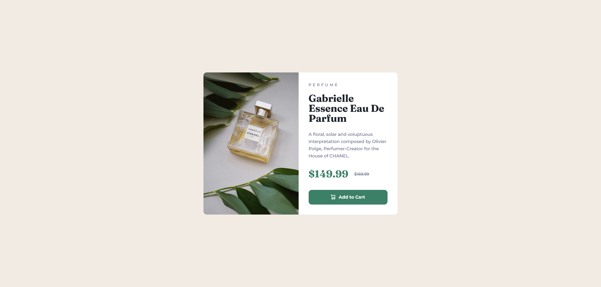
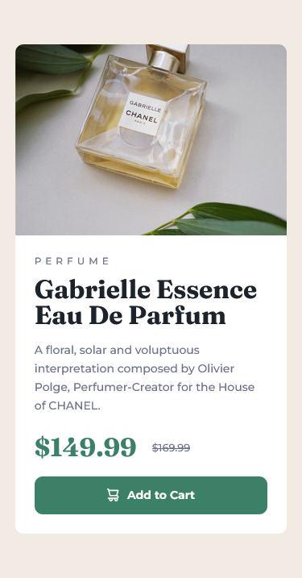

# Frontend Mentor - Product preview card component

Hi, I'm Anthony Acosta and this is my solution to the product preview card component, I really hope you like and also any feedback would be appreciated.

## Table of contents 📋

- [Overview](#overview)
  - [The challenge](#the-challenge)
  - [Screenshot](#screenshot)
  - [Links](#links)
- [My process](#my-process)
  - [Built with](#built-with)
  - [What I learned](#what-i-learned)
  - [Continued development](#continued-development)
  - [Useful resources](#useful-resources)
- [Author](#author)
- [Acknowledgments](#acknowledgments)

## Overview

I made this with CSS only and with custom properties as well, since I have Figma design files, I took adventage of the real values to exactly match the right borders and margins. By the way I really love this stuff because I'm learning Figma along the way. I had so much fun while doing this.

### Screenshots




<p align="middle">
   
</p>

### Links

- Solution URL: [Github repo](https://github.com/874anthony/product-preview-card)
- Live Site URL: [Site](https://starlit-gingersnap-750aca.netlify.app/)

## My process

So I first started designing the HTML markup, then moved forward to the css file, importing the corresponding font types (Monserrat and the other one haha) and started to declare properties, this time I set the font-size back to 62.5% to do quick math on rems and ems. (10 / 16 \* 100 = 62,5) so 1rem = 10px; by the end I forgot to add the hover interaction, so I did it very fast with :hover on the button and :focus-within on the card itself.

### Built with

- CSS custom properties

### What I learned

So in this challenge I think I've gained a little bit more confidence when it comes to mobile-first design with media queries, I was so used to start designing for larger viewports but then overall, overriding all these properties was a nightmare.

A thing to point out here was the image selection, at first I tried:

```css
.card_img {
  background-image: url(path/to-mobile-image);
}

@media (min-width: 40rem) {
  /* 600 pxs */
  .card__img {
    background-image: url(path/to-desktop-image);
  }
}
```

I thought that was enough to make it work.. but obviously it wasn't, so I ended up with just a little validation

```js
const { innerWidth } = window;

if (innerWidth <= 600) {
  img.src = "images/image-product-mobile.jpg";
} else {
  img.src = "images/image-product-desktop.jpg";
}
```

### Continued development

I want to improve on the point above, I want to know best practices when it comes to select the corresponding image.

## Author

- Anthony Acosta - [@874anthony](https://www.frontendmentor.io/profile/874anthony)
- Codepen - [@874anthony](https://codepen.io/874anthony)
